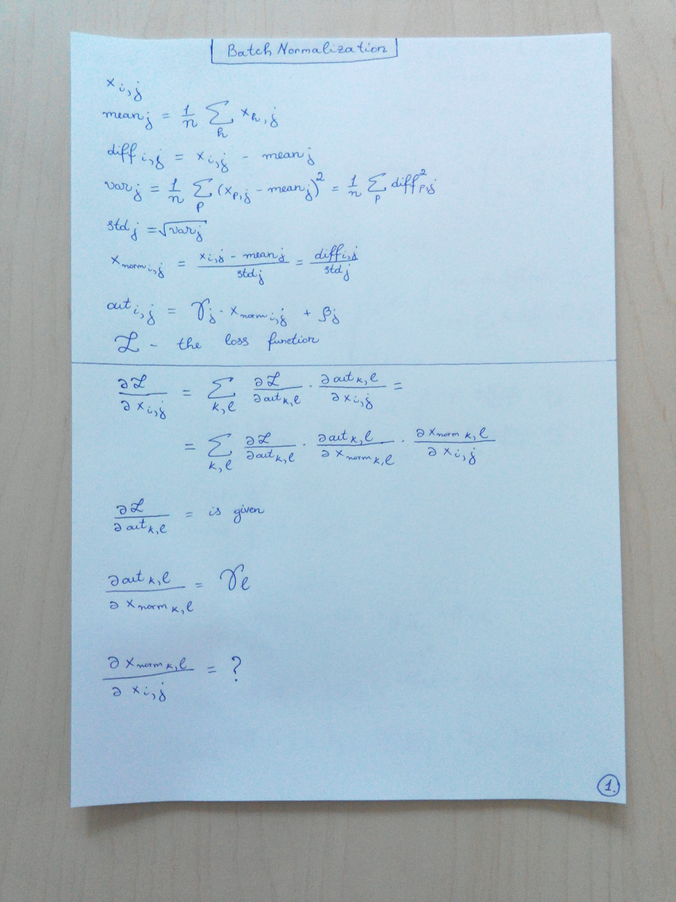
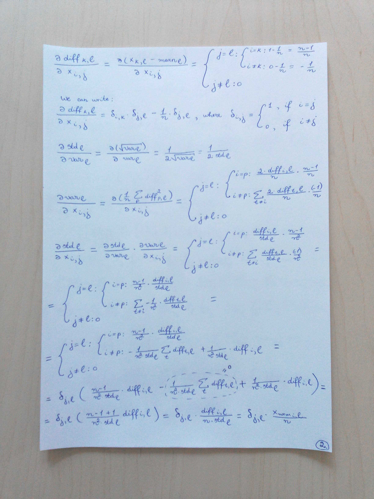
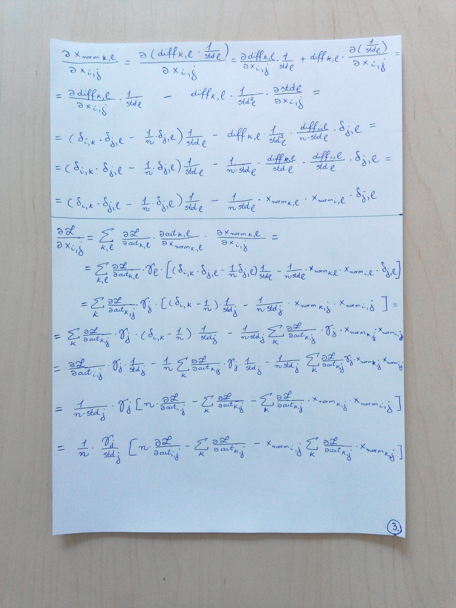

# Batch normalization

## [Batch Normalization: Accelerating Deep Network Training by Reducing Internal Covariate Shift (Ioffe and Szegedy, 2015)](https://arxiv.org/abs/1502.03167)
* In the case of deep neural networks, training is considered to be complicated by the fact that the distribution of each layer's inputs changes during training, as the parameters of the previous layers change.
This slows down the training (by requiring lower learning rates and careful parameter initialization) and makes it hard to train models with saturating nonlinearities. This phenomenon is known as __internal covariate shift__, and is addressed by normalizing layer inputs.

* __The Internal Covariate Shift__ - the change in the distribution of network activations due to the change in network parameters during training.

* The goal of BN is to achieve a stable distribution of activation values throughout training.

* The BN layer is added immediately before the nonlinearity (sigmoid, tanh, relu), since that is where matching the first and second moment is more likely to result in a stable distribution.

* __Batch normalization__:  
   1. allows to use much higher learning rates;
   2. allows to be less careful about initialization;
   3. acts as a regularizer, in some cases eliminating the need for dropout;
   4. has a beneficial effect on the gradient flow through the network, by reducing the dependence of gradients on the scale of the parameters or of their initialization;
   5. makes the training faster.

## Backward pass of batch normalization layer
Good links:  
1. [Computational graph (naive implementation)](https://kratzert.github.io/2016/02/12/understanding-the-gradient-flow-through-the-batch-normalization-layer.html)
2. [Gradients on paper (a faster implementation)](http://cthorey.github.io/backpropagation/)

**My notes**:  
  
  
  

