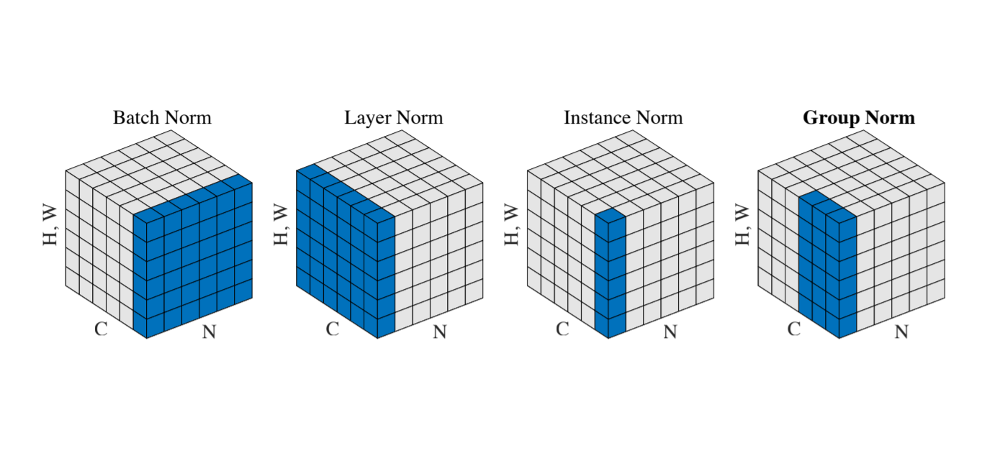

# Group normalization

## [Group Normalization (Yuxin Wu and Kaiming He, 2018)](https://arxiv.org/abs/1803.08494)
* Group Normalization (GN) - a simple alternative to Batch Normalization (BN).

* GN divides the channels into groups and computes within each group the mean and variance for normalization.

* GN:  
1.) Computation is independent of batch size;  
2.) Its accuracy is stable in a wide range of batch sizes.

* GN performance:  
1.) Small batches (batch size = [2, 4]): outperforms other normalization methods;  
2.) Regular batches (batch size = [16, 32, 64]): is comparably good as BN.

* Normalization methods (from \[[1]\]):  
  

[1]: https://arxiv.org/pdf/1803.08494.pdf
