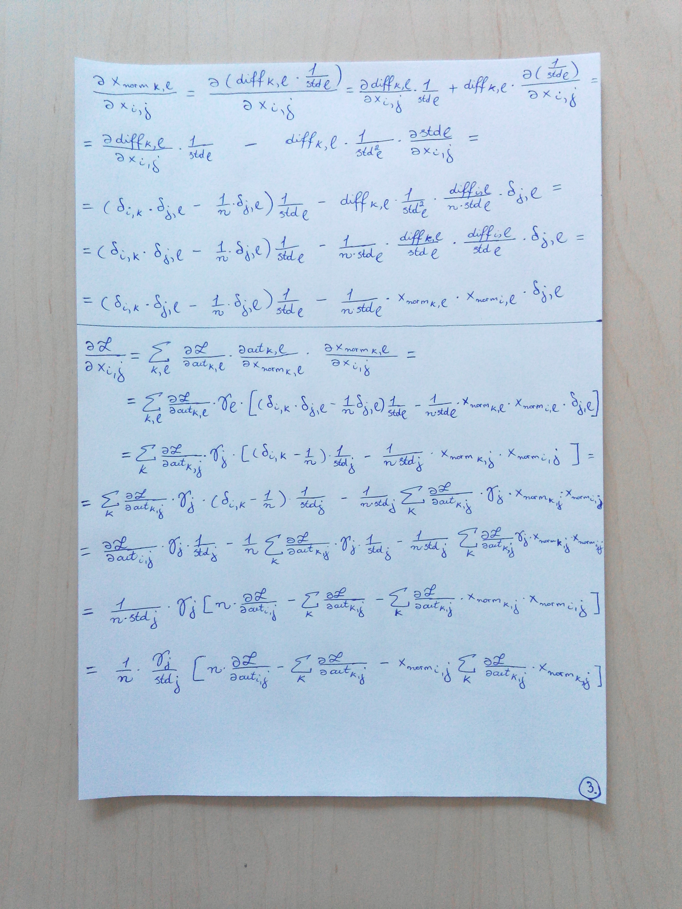

# Batch normalization

## Backward pass of batch normalization layer
Good links:  
1. [Computational graph (naive implementation)](https://kratzert.github.io/2016/02/12/understanding-the-gradient-flow-through-the-batch-normalization-layer.html)
2. [Gradients on paper (a faster implementation)](http://cthorey.github.io/backpropagation/)

**My notes**:  
  
  
  
